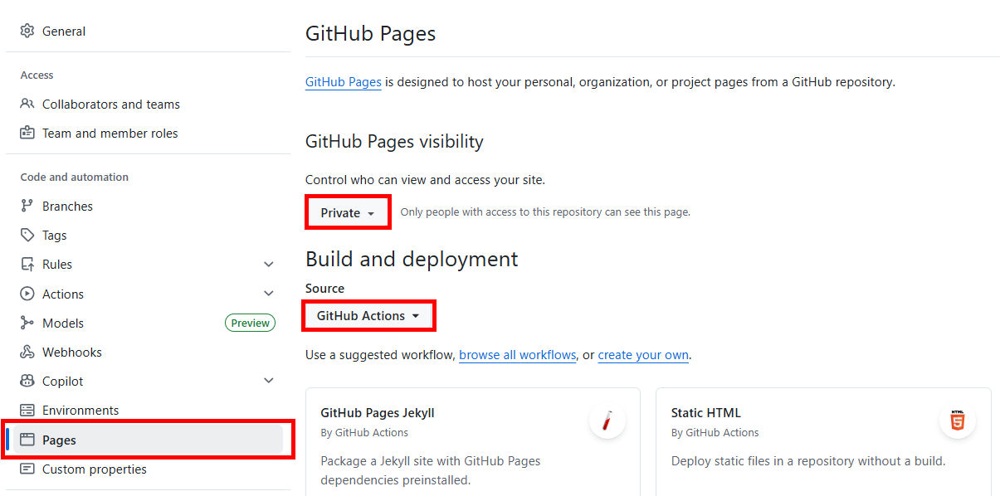

# Deploy and Configure Docusaurus

This document describes a step-by-step path to: **scaffold a Docusaurus site**, **move your repo’s Markdown into it**, and **publish via GitHub Pages** in line with the current Docusaurus install + deploy docs. ([docusaurus.io][1])

## 0. Prereqs

### 0.1 GitHub

#### Create a GitHub repo and push your Docusaurus site

Create a GitHub repo and clone that repo to your development system.

#### Enable GitHub Pages to deploy from Actions

In GitHub:

* Repo → **Settings** → **Pages**
* **Build and deployment** → Source: **GitHub Actions** (not “deploy from branch”) ([GitHub][5])



### 0.2 Prereqs on Windows

#### Install Node.js (required)

1. Install **Node.js 18+** (LTS is best).
2. Verify in a fresh terminal:

   ```powershell
   node -v
   npm -v
   ```

Docusaurus requires Node 18+ (v3+). ([docusaurus.io][2])

#### Optional but recommended

* **Git** installed (so you can push + GitHub Actions).
* VS Code (or alternate IDE).

## 1. Create (scaffold) a Docusaurus site

Open PowerShell (or VS Code terminal) in the folder where you want the site.

1. Run the official scaffolder:

   ```powershell
   npx create-docusaurus@latest pe-docs classic
   ```

   This creates a new folder `pe-docs` with a working site. ([docusaurus.io][1])

   When asked "Which language do you want to use?", select `TypeScript`.

2. Start it locally:

   ```powershell
   cd my-docs
   npm install
   npm install --save @docusaurus/theme-mermaid # Enable Mermaid functionality by adding plugin @docusaurus/theme-mermaid and setting markdown.mermaid to true in your docusaurus.config.js.
   npm run start
   ```

3. Open the local URL it prints (usually `http://localhost:3000`).

---

## 2. Initial configuration and branding for Atos

Open `docusaurus.config.js` (or `.ts`) in the site root. This is the main site config file. ([docusaurus.io][3])

### Configure the main banner on the homepage.

Find this section in the `docusaurus.config.js` file:

```ts
const config: Config = {
  title: 'My Site',
  tagline: 'Dinosaurs are cool',
  favicon: 'img/favicon.ico',
  ...
}
```

Replace it with the follwowing content:

```ts
const config: Config = {
  title: 'Atos Platform Engineering Documentation',
  tagline: 'Platform Product documentation developed by the Atos C&MI BNN Public Cloud & Platform Engineering team.',
  favicon: 'img/atos_logo_blue.svg',
  ...
}
```

### Set the production url of our site

Find this section in the `docusaurus.config.js` file:

```ts
const config: Config = {
  ...
  // Set the production url of your site here
  url: 'https://your-docusaurus-site.example.com',
  // Set the /<baseUrl>/ pathname under which your site is served
  // For GitHub pages deployment, it is often '/<projectName>/'
  baseUrl: '/',

  // GitHub pages deployment config.
  // If you aren't using GitHub pages, you don't need these.
  organizationName: 'facebook', // Usually your GitHub org/user name.
  projectName: 'docusaurus', // Usually your repo name.
  ...
}
```

Replace it with the follwowing content:

```ts
const config: Config = {
  ...
  // Set the production url of your site here
  url: 'https://nl-ams-platform-engineer.github.io',
  // Set the /<baseUrl>/ pathname under which your site is served
  // For GitHub pages deployment, it is often '/<projectName>/'
  baseUrl: '/documentation/',

  // GitHub pages deployment config.
  // If you aren't using GitHub pages, you don't need these.
  organizationName: 'NL-AMS-PLATFORM-ENGINEER', // Usually your GitHub org/user name.
  projectName: 'documentation', // Usually your repo name.
  ...
}
```

### Add Mermaid theme

Add this section in the `docusaurus.config.js` file right above the presets: [] section:

```ts
const config: Config = {
  ...
  // Added Mermaid theme
  themes: ['@docusaurus/theme-mermaid'],

  // Enable Mermaid in markdown files
  markdown: {
    mermaid: true,
  },
  ...
}
```

### Customize the presets section

Find this section in the `docusaurus.config.js` file:

```ts
const config: Config = {
  ...
  presets: [
    [
      'classic',
      {
        docs: {
          sidebarPath: './sidebars.ts',
          // Please change this to your repo.
          // Remove this to remove the "edit this page" links.
          editUrl:
            'https://github.com/facebook/docusaurus/tree/main/packages/create-docusaurus/templates/shared/',
        },
        blog: {
          showReadingTime: true,
          feedOptions: {
            type: ['rss', 'atom'],
            xslt: true,
          },
          // Please change this to your repo.
          // Remove this to remove the "edit this page" links.
          editUrl:
            'https://github.com/facebook/docusaurus/tree/main/packages/create-docusaurus/templates/shared/',
          // Useful options to enforce blogging best practices
          onInlineTags: 'warn',
          onInlineAuthors: 'warn',
          onUntruncatedBlogPosts: 'warn',
        },
        theme: {
          customCss: './src/css/custom.css',
        },
      } satisfies Preset.Options,
    ],
  ],
  ...
}
```

Update the `editURL`, and set the `blog` to `false`:

```ts
const config: Config = {
  ...
  presets: [
    [
      'classic',
      {
        docs: {
          sidebarPath: './sidebars.ts',
          // Please change this to your repo.
          // Remove this to remove the "edit this page" links.
          editUrl:
            'https://github.com/NL-AMS-PLATFORM-ENGINEER/documentation/tree/main/pe-docs/',
        },
        blog: false,
        theme: {
          customCss: './src/css/custom.css',
        },
      } satisfies Preset.Options,
    ],
  ],
  ...
};
```

### Customize the themeConfig section

Find this section in the `docusaurus.config.js` file:

```ts
const config: Config = {
  ...
  themeConfig: {
    // Replace with your project's social card
    image: 'img/docusaurus-social-card.jpg',
    colorMode: {
      respectPrefersColorScheme: true,
    },
    navbar: {
      title: 'My Site',
      logo: {
        alt: 'My Site Logo',
        src: 'img/logo.svg',
      },
      items: [
        {
          type: 'docSidebar',
          sidebarId: 'tutorialSidebar',
          position: 'left',
          label: 'Tutorial',
        },
        {to: '/blog', label: 'Blog', position: 'left'},
        {
          href: 'https://github.com/facebook/docusaurus',
          label: 'GitHub',
          position: 'right',
        },
      ],
    },
    footer: {
      style: 'dark',
      links: [
        {
          title: 'Docs',
          items: [
            {
              label: 'Tutorial',
              to: '/docs/intro',
            },
          ],
        },
        {
          title: 'Community',
          items: [
            {
              label: 'Stack Overflow',
              href: 'https://stackoverflow.com/questions/tagged/docusaurus',
            },
            {
              label: 'Discord',
              href: 'https://discordapp.com/invite/docusaurus',
            },
            {
              label: 'X',
              href: 'https://x.com/docusaurus',
            },
          ],
        },
        {
          title: 'More',
          items: [
            {
              label: 'Blog',
              to: '/blog',
            },
            {
              label: 'GitHub',
              href: 'https://github.com/facebook/docusaurus',
            },
          ],
        },
      ],
      copyright: `Copyright © ${new Date().getFullYear()} My Project, Inc. Built with Docusaurus.`,
    },
    prism: {
      theme: prismThemes.github,
      darkTheme: prismThemes.dracula,
    },
  } satisfies Preset.ThemeConfig,
  ...
};
```

Update the section as follows:

* Add the Mermaid theme config
* Update the navbar (remove blog section and update title, logo, sidebarID, and label)
* Update the footer

```ts
const config: Config = {
  ...
  themeConfig: {
    // Replace with your project's social card
    image: 'img/docusaurus-social-card.jpg',
    colorMode: {
      respectPrefersColorScheme: true,
    },
    // Added Mermaid theme config
    mermaid: {
      theme: {light: 'neutral', dark: 'forest'},
    },
    navbar: {
      title: 'Atos Platform Engineering',
      logo: {
        alt: 'Atos Platform Engineering Logo',
        src: 'img/atos_logo_blue.svg',
      },
      items: [
        {
          type: 'docSidebar',
          sidebarId: 'documentationSidebar',
          position: 'left',
          label: 'Documentation',
        },
      ],
    },
    footer: {
      style: 'dark',
      links: [
        {
          title: 'Docs',
          items: [
            {
              label: 'Home',
              to: '/docs/overview',
            },
          ],
        },
        {
          title: 'Community',
          items: [
            {
              label: 'LinkedIn',
              href: 'https://www.linkedin.com/company/1259/',
            },
            {
              label: 'X',
              href: 'https://x.com/atos',
            },
          ],
        },
        {
          title: 'More',
          items: [
            {
              label: 'Atos.net',
              href: 'https://atos.net/en/services/cloud-and-modern-infrastructure',
            },
            {
              label: 'GitHub',
              href: 'https://github.com/NL-AMS-PLATFORM-ENGINEER/documentation',
            },
          ],
        },
      ],
      copyright: `Copyright © ${new Date().getFullYear()} Atos International. Built with Docusaurus.`,
    },
    prism: {
      theme: prismThemes.github,
      darkTheme: prismThemes.dracula,
    },
  } satisfies Preset.ThemeConfig,
};
```

### Sidebars (navigation)

* The classic template usually auto-generates a sidebar from your docs folder, but you can explicitly control it in `sidebars.ts`.
* If you want docs to reflect your repo’s folder structure, mirror it under `docs/`.

Tip: If you already have a folder like `/docs` in your GitHub repo, you can **reuse it** by copying contents into Docusaurus’ `docs/` folder, or by restructuring so Docusaurus becomes the root and your docs live under `docs/`.

Open `sidebars.ts`

Find this section in the `docusaurus.config.js` file:

```ts
const sidebars: SidebarsConfig = {
  // By default, Docusaurus generates a sidebar from the docs folder structure
  tutorialSidebar: [{type: 'autogenerated', dirName: '.'}],
};
```

Change the name of the sidebar as follows:

```ts
const sidebars: SidebarsConfig = {
  // By default, Docusaurus generates a sidebar from the docs folder structure
  documentationSidebar: [{type: 'autogenerated', dirName: '.'}],
};
```

---

## 3. Lets add some Atos branding

Open `src/css/custom.css`. This is where the global Cascading Style Sheets (CSS) are defined.
Modify the current content below:

```css
:root {
  --ifm-color-primary: #2e8555;
  --ifm-color-primary-dark: #29784c;
  --ifm-color-primary-darker: #277148;
  --ifm-color-primary-darkest: #205d3b;
  --ifm-color-primary-light: #33925d;
  --ifm-color-primary-lighter: #359962;
  --ifm-color-primary-lightest: #3cad6e;
  --ifm-code-font-size: 95%;
  --docusaurus-highlighted-code-line-bg: rgba(0, 0, 0, 0.1);
}

/* For readability concerns, you should choose a lighter palette in dark mode. */
[data-theme='dark'] {
  --ifm-color-primary: #25c2a0;
  --ifm-color-primary-dark: #21af90;
  --ifm-color-primary-darker: #1fa588;
  --ifm-color-primary-darkest: #1a8870;
  --ifm-color-primary-light: #29d5b0;
  --ifm-color-primary-lighter: #32d8b4;
  --ifm-color-primary-lightest: #4fddbf;
  --docusaurus-highlighted-code-line-bg: rgba(0, 0, 0, 0.3);
}
```

To align to the Atos corporate branding. For now we just change the primary color:

```css
:root {
  --ifm-color-primary: #0073E6; /* Atos Blue */
  --ifm-color-primary-dark: #29784c;
  --ifm-color-primary-darker: #277148;
  --ifm-color-primary-darkest: #205d3b;
  --ifm-color-primary-light: #33925d;
  --ifm-color-primary-lighter: #359962;
  --ifm-color-primary-lightest: #3cad6e;
  --ifm-code-font-size: 95%;
  --docusaurus-highlighted-code-line-bg: rgba(0, 0, 0, 0.1);
}

/* For readability concerns, you should choose a lighter palette in dark mode. */
[data-theme='dark'] {
  --ifm-color-primary: #3DC7FF; /* Some other Blue */
  --ifm-color-primary-dark: #21af90;
  --ifm-color-primary-darker: #1fa588;
  --ifm-color-primary-darkest: #1a8870;
  --ifm-color-primary-light: #29d5b0;
  --ifm-color-primary-lighter: #32d8b4;
  --ifm-color-primary-lightest: #4fddbf;
  --docusaurus-highlighted-code-line-bg: rgba(0, 0, 0, 0.3);
}
```

---

## 4. Put your repo’s Markdown into Docusaurus

Docusaurus expects docs in the `docs/` folder (by default in the classic template).

You can now start creating markdown content in this folder and subfolders.
You can also copy existing `.md` / `.mdx` files into:

   ```
   my-docs/docs/
   ```

Make sure each doc has a unique **id** or filename, and ideally a title.

   * Docusaurus uses front matter + file structure to build navigation.

You only need to set id if:

* You want to rename the file but keep old URLs	Preserve links
* You import READMEs from other repos that all have README.md	Prevent collisions
* You want short / custom URLs	Branding or stability
* You have name collisions (intro.md in multiple folders)	Avoid ambiguity

Example:

```markdown
---
id: pe-architecture
title: Platform Engineering Architecture
---

# Platform Engineering Architecture
Continue document
```

Even if the file is README.md, the page id becomes pe-architecture.

---

## 5. Organize and Cleanup

### Create initial folder structure

Under the `pe-docs/docs` folder we can organize our documentation.
The scaffolding already created some sample content:

```markdown
docs/
 ├─ intro.md
 ├─ tutorial-basics/
 |   ├─ _category_.json
 |   ├─ congratulations.md
 |   ├─ create-a-blog-post.md
 |   ├─ create-a-document.md
 |   ├─ create-a-page.md
 |   ├─ deploy-your-site.md
 |   └─ markdown-features.mdx
 └─ tutorial-extras/
     ├─ img/
     |   └─ docsVersionDropdown.png
     |   └─ localeDropdown.png
     ├─ _category_.json
     ├─ manage-docs-versions.md
     └─ translate-your-site.md
```

Instead of deleting this altogether, we will move all scaffolded content to a new folder named `work-with-docusaurus`.

Now lets rename the `docs/intro.md` to `docs/overview.md`.
Add some information for this landing page.

Create the following new folders:

* `docs/achtitecture`
* `docs/platform-products`

You can add `_category_.json` files to each parent folder to organize the order in the sidenav.

Now we can start adding content!

### Cleanup blog folder

Because we removed the blog section, its good to also remove the `blog` folder.
Assuming you are in the `pe-docs` folder:

```powershell
rmdir blog -force
```

## 6. Publish with GitHub Actions (recommended)

Docusaurus supports a static build and deployment flows; GitHub Pages commonly uses Actions now.

### 6.1 Add a GitHub Actions workflow

Create this file:

```
.github/workflows/deploy.yml
```

```yaml
name: Deploy to GitHub Pages

on:
  push:
    branches:
      - main

jobs:
  build:
    name: Build Docusaurus
    runs-on: ubuntu-latest
    defaults:
      run:
        working-directory: pe-docs

    steps:
      - uses: actions/checkout@v4
        with:
          fetch-depth: 0

      - uses: actions/setup-node@v4
        with:
          node-version: 20
          cache: npm
          cache-dependency-path: pe-docs/package-lock.json

      - name: Install dependencies
        run: npm ci

      - name: Build website
        run: npm run build

      - name: Upload Build Artifact
        uses: actions/upload-pages-artifact@v3
        with:
          path: pe-docs/build

  deploy:
    name: Deploy to GitHub Pages
    needs: build

    permissions:
      pages: write
      id-token: write

    environment:
      name: github-pages
      url: ${{ steps.deployment.outputs.page_url }}

    runs-on: ubuntu-latest
    steps:
      - name: Deploy to GitHub Pages
        id: deployment
        uses: actions/deploy-pages@v4

```

> **Tip!** Use the official Docusaurus deployment guidance as your baseline. ([docusaurus.io][4])

---

## 7. Build + verify locally before deploying

Run:

```powershell
npm run build
npm run serve -- --build
```

This verifies the production build output locally (recommended before pushing changes). ([docusaurus.io][4])

---

## 8. Typical “gotchas” when importing Markdown

* **Relative links** between docs might need adjusting once under `docs/`.
* If you use lots of GitHub-flavored Markdown features, check rendering (Docusaurus uses MDX/remark pipeline).
* If you need versioned docs later, Docusaurus supports versioning, but you can skip that for day 1. ([docusaurus.io][6])

---

## 9. Add a Video Gallery (Demo's page)

The site includes a **Demo's** page accessible from the top navigation bar. It renders a responsive video gallery with tag-based filtering, supporting both Microsoft Stream/SharePoint embed URLs and direct video files (via `react-player`).

### 9.1 Install react-player

From the **repository root** (not `pe-docs`), install the `react-player` package:

```bash
npm install react-player
```

This adds the dependency to the root `package.json`. The `react-player` library supports YouTube, Vimeo, Twitch, Spotify, TikTok, and direct video files (`.mp4`, `.webm`, etc.).

> **Note:** `react-player` does **not** support Microsoft Stream / SharePoint embed URLs natively. The `VideoGallery` component handles these separately using an `<iframe>` (of all things...).

### 9.2 Project structure

The video gallery feature consists of these files:

```
pe-docs/src/
 ├─ data/
 │   └─ demos.ts                        # Video data & Video type definition
 ├─ components/
 │   └─ VideoGallery/
 │       ├─ index.tsx                    # Gallery component (filtering & layout)
 │       ├─ VideoCard.tsx                # Single video card component
 │       └─ styles.module.css            # CSS module for grid, cards, tags
 └─ pages/
     └─ demos.tsx                        # /demos page (wired to navbar)
```

The gallery is split into two components: `index.tsx` handles tag filtering and the grid layout, while `VideoCard.tsx` owns the rendering of a single video card (embed detection, player, info, and tags).

### 9.3 Add the navbar item

In `docusaurus.config.ts`, add a new item to the `navbar.items` array:

```ts
navbar: {
  ...
  items: [
    {
      type: 'docSidebar',
      sidebarId: 'documentationSidebar',
      position: 'left',
      label: 'Docs',
    },
    {
      to: '/demos',
      label: "Demo's",
      position: 'left',
    },
  ],
},
```

### 9.4 Managing videos

To add, remove, or update videos, edit `src/data/demos.ts`. Each video entry has the following fields:

| Field         | Required | Description                                                    |
| ------------- | -------- | -------------------------------------------------------------- |
| `title`       | Yes      | Display title shown below the video player                     |
| `url`         | Yes      | Video URL (embed URL for Stream, direct URL for files/YouTube) |
| `description` | No       | Short description shown below the title                        |
| `tags`        | No       | Array of tag strings used for filtering                        |

Example:

```ts
export const demoVideos: Video[] = [
  {
    title: 'Platform Engineering Overview',
    url: 'https://atos365.sharepoint.com/sites/BNNCMIPO/_layouts/15/embed.aspx?UniqueId=...',
    description: 'Standardized, Secure and Scalable Infrastructure Provisioning.',
    tags: ['platform', 'kratix', 'backstage'],
  },
];
```

### 9.5 Supported video sources

| Source                          | URL format                                                                 | Rendered with     |
| ------------------------------- | -------------------------------------------------------------------------- | ----------------- |
| Microsoft Stream / SharePoint   | `https://{tenant}.sharepoint.com/sites/{site}/_layouts/15/embed.aspx?...`  | `<iframe>`        |
| YouTube                         | `https://www.youtube.com/watch?v=...`                                      | `react-player`    |
| Vimeo                           | `https://vimeo.com/...`                                                    | `react-player`    |
| Direct video file               | `https://example.com/video.mp4`                                            | `react-player`    |

> **Important:** For SharePoint videos, always use the **embed URL** from the SharePoint "Embed" dialog (`_layouts/15/embed.aspx?UniqueId=...`). The regular sharing URL (`:v:/r/sites/...`) will be blocked by SharePoint's `X-Frame-Options` header and fail to load in an iframe.

### 9.6 Tag-based filtering

Videos can be tagged for easy filtering:

* Tags are defined per video in `src/data/demos.ts` using the `tags` field.
* Tags appear as pill-shaped buttons above the video grid.
* Clicking a tag toggles it as a filter. Multiple selected tags use **AND** logic (a video must have all selected tags to be shown).
* A **Clear filters** button appears when any filter is active.
* Each video card also displays its tags below the description.

---

## 10.0 Image optimization

Install ImageMagick

```powershell
# Install ImageMagick
winget install ImageMagick.ImageMagick

# Find install location
Get-ChildItem "C:\Program Files" -Recurse -Filter magick.exe -ErrorAction SilentlyContinue

# Add ImageMagick location to the path
$env:Path += ";C:\Program Files\ImageMagick-7.1.2-Q16-HDRI" # Path may be different
```

```powershell

$svgPath = Join-Path $PWD "static\img\atos_agentic_ai.svg"
$pngPath = Join-Path $PWD "static\img\atos_agentic_ai.png"

$svgPath = Join-Path $PWD "static/img/atos_docs_sol.svg"
$pngPath = Join-Path $PWD "static/img/atos_docs_sol.png"

$svgPath = Join-Path $PWD "static/img/atos_prod_catalog.svg"
$pngPath = Join-Path $PWD "static/img/atos_prod_catalog.png"


$svg = Get-Content $svgPath -Raw
$base64 = [regex]::Match($svg,'base64,([^"]+)').Groups[1].Value

[IO.File]::WriteAllBytes(
    $pngPath,
    [Convert]::FromBase64String($base64)
)

Get-Item .\static\img\atos_agentic_ai.png

# concert images
magick static/img/atos_agentic_ai.png static/img/atos_agentic_ai.webp
magick static/img/atos_docs_sol.png static/img/atos_docs_sol.webp
magick static/img/atos_prod_catalog.png static/img/atos_prod_catalog.webp
```

Or run this script:

```powershell
$ErrorActionPreference = "Stop"

$files = @(
    "atos_agentic_ai",
    "atos_docs_sol",
    "atos_prod_catalog"
)

$imgDir = Join-Path $PWD "static\img"

foreach ($file in $files) {
    $svgPath  = Join-Path $imgDir "$file.svg"
    $pngPath  = Join-Path $imgDir "$file.png"
    $webpPath = Join-Path $imgDir "$file.webp"

    Write-Host "Processing $file..."

    $svg = Get-Content $svgPath -Raw
    $match = [regex]::Match($svg, 'base64,([^"]+)')

    if (-not $match.Success) {
        Write-Warning "No embedded base64 image found in $svgPath"
        continue
    }

    $base64 = $match.Groups[1].Value
    [IO.File]::WriteAllBytes($pngPath, [Convert]::FromBase64String($base64))

    magick $pngPath -quality 85 $webpPath

    Write-Host "Created $webpPath"
}

Write-Host "Done."
```

## 11. Render external docs locally

Make sure that you have configured
[SSH](https://docs.github.com/en/authentication/connecting-to-github-with-ssh/adding-a-new-ssh-key-to-your-github-account)
to pull from github, then proceed with the following

```powershell
# Check for existing SSH keys
ls -Force ~/.ssh
# If there are 0 known_hosts, then generate a new SSH key and add it to your GitHub account

# Generate key (Ed25519 is a modern cryptographic algorithm used to create SSH key pairs)
ssh-keygen -t ed25519 -C "robertvanvugt@outlook.com"
# When asked where to save the key, press Enter to accept the default location: C:\Users\A168579\.ssh\id_ed25519
# When asked for a passphrase, enter one for recommended extra protection. GitHub notes that the SSH agent can remember the passphrase so you do not need to type it every time.

# In Admin PowerShell (This is a one-time action to enable the ssh-agent service, it must be run in an elevated PowerShell prompt)
Get-Service -Name ssh-agent | Set-Service -StartupType Manual
Start-Service ssh-agent

# In normal PowerShell
ssh-add $HOME\.ssh\id_ed25519

# Copy public key
Get-Content $HOME\.ssh\id_ed25519.pub | Set-Clipboard

# Optional Git for Windows fix: force Git to use Windows OpenSSH
# On Windows, Git for Windows can sometimes use its own bundled SSH instead of the Windows SSH agent. GitHub documents this as a possible conflict and recommends forcing Git to use the system OpenSSH binary
git config --global core.sshCommand "C:/Windows/System32/OpenSSH/ssh.exe"

# Add the public key to your GitHub account using the GitHub web interface:
# In GitHub:
# Go to Settings
# Go to SSH and GPG keys
# Click New SSH key
# Give it a title, for example: A168579 Windows laptop
# Paste the copied public key
# Save it


# ALTERNATIVE: Add the public key to your GitHub account using the GitHub CLI (gh):
gh auth login
# Select GitHub.com

# Add the public key to your GitHub account:
gh ssh-key add $HOME\.ssh\id_ed25519.pub --title "Atos Windows laptop"

###########################
# Test
ssh -T git@github.com
# The first time, you may be asked whether you trust GitHub’s host key. Type: yes
# A successful result usually looks like: Hi <username>! You've successfully authenticated, but GitHub does not provide shell access.

```

### Viewing external documentation locally

The documentation pipeline copies external documentation into the Docusaurus project before building the site. To reproduce this locally, run the following commands from the `pe-docs/` folder:

```bash
npm run merge
npm run start
```

The `merge` step copies the external documentation into the local documentation tree, after which `npm run start` starts the local Docusaurus development server.

After testing, remove the copied external documentation before committing changes. First run a dry run to review what Git will remove:

```bash
git clean -fdn
```

If the output only contains generated or copied documentation that should be removed, run:

```bash
git clean -fd
```

Be careful: `git clean -fd` removes all untracked files and directories in the current repository path. Do not run it if the dry run shows local work-in-progress or files you still need.


## References

[1]: https://docusaurus.io/docs/installation "Installation"
[2]: https://docusaurus.io/docs/3.1.1/installation "Installation"
[3]: https://docusaurus.io/docs/api/docusaurus-config "docusaurus.config.js"
[4]: https://docusaurus.io/docs/deployment "Deployment"
[5]: https://github.com/LayZeeDK/github-pages-docusaurus "A Docusaurus website deployed to GitHub Pages using ..."
[6]: https://docusaurus.io/docs/versioning "Versioning"
